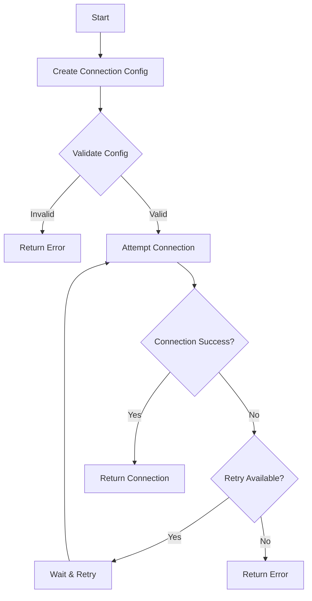

# MongoDB Connect Plus 🚀

<div align="center">


A modern, robust MongoDB connection utility with automatic retry, connection pooling, and TypeScript support for MERN stack applications.

[Features](#features) • [Installation](#installation) • [Quick Start](#quick-start) • [Documentation](#documentation) • [Examples](#examples) • [Contributing](#contributing)

</div>

## ✨ Features

- 🔄 **Automatic Retry Logic**

  - Configurable retry attempts
  - Exponential backoff
  - Custom retry intervals
  - Smart error handling

- 🔌 **Connection Pooling**

  - Optimized pool sizes
  - Automatic pool management
  - Pool statistics
  - Connection lifecycle events

- 📝 **Built-in Logging**

  - Winston-based logging
  - Multiple log levels
  - JSON and simple formats
  - Customizable logging options

- 🔑 **Multiple MongoDB Support**

  - Connect to multiple databases
  - Named connections
  - Individual connection management
  - Connection status tracking

- 🎯 **TypeScript Support**
  - Full type definitions
  - Interface exports
  - Type safety
  - Better IDE support

## 📦 Installation

```bash
npm install mongodb-connect-plus
# or
yarn add mongodb-connect-plus
```

## 🚀 Quick Start

```typescript
import { connect } from "mongodb-connect-plus";

// Basic usage
const result = await connect({
  uri: "mongodb://localhost:27017/myapp",
  options: {
    maxPoolSize: 10,
    minPoolSize: 2,
  },
});

if (result.success) {
  console.log("Connected successfully!");
} else {
  console.error("Connection failed:", result.error);
}
```

## 📚 Documentation

### Connection Flow



### Configuration Options

#### ConnectionConfig

```typescript
interface ConnectionConfig {
  uri: string; // MongoDB connection URI
  options?: ConnectOptions; // Mongoose connection options
  retryOptions?: RetryOptions; // Retry configuration
  loggingOptions?: LoggingOptions; // Logging configuration
}
```

#### RetryOptions

```typescript
interface RetryOptions {
  maxRetries: number; // Maximum number of retry attempts
  retryInterval: number; // Initial retry interval in milliseconds
  backoffFactor: number; // Exponential backoff multiplier
}
```

#### LoggingOptions

```typescript
interface LoggingOptions {
  enabled: boolean; // Enable/disable logging
  level: "error" | "warn" | "info" | "debug"; // Log level
  format: "json" | "simple"; // Log format
}
```

### Advanced Usage

#### Multiple Connections

```typescript
import { connectMultiple } from "mongodb-connect-plus";

const results = await connectMultiple({
  primary: {
    uri: "mongodb://localhost:27017/primary",
    options: { maxPoolSize: 5 },
  },
  secondary: {
    uri: "mongodb://localhost:27017/secondary",
    options: { maxPoolSize: 3 },
  },
});
```

#### Custom Logger

```typescript
import { Logger } from "mongodb-connect-plus";

const logger = new Logger({
  level: "debug",
  format: "json",
});
```

#### Connection Management

```typescript
import { MongoDBConnection } from "mongodb-connect-plus";

const connection = new MongoDBConnection();

// Connect
const result = await connection.connect({
  uri: "mongodb://localhost:27017/myapp",
});

// Get connection
const db = connection.getConnection("default");

// Disconnect
await connection.disconnect();
```

## 🔧 Examples

### Basic Express.js Integration

```typescript
import express from "express";
import { connect } from "mongodb-connect-plus";

const app = express();

async function startServer() {
  const result = await connect({
    uri: process.env.MONGODB_URI,
    options: {
      maxPoolSize: 10,
      minPoolSize: 2,
    },
  });

  if (!result.success) {
    console.error("Failed to connect to MongoDB:", result.error);
    process.exit(1);
  }

  app.listen(3000, () => {
    console.log("Server running on port 3000");
  });
}

startServer();
```

### Next.js Integration

```typescript
// lib/mongodb.ts
import { connect } from "mongodb-connect-plus";

let cachedConnection: any = null;

export async function connectToDatabase() {
  if (cachedConnection) {
    return cachedConnection;
  }

  const result = await connect({
    uri: process.env.MONGODB_URI,
    options: {
      maxPoolSize: 10,
      minPoolSize: 2,
    },
  });

  if (!result.success) {
    throw new Error("Failed to connect to MongoDB");
  }

  cachedConnection = result.connection;
  return cachedConnection;
}
```

### NestJS Integration

```typescript
// mongodb.module.ts
import { Module } from "@nestjs/common";
import { connect } from "mongodb-connect-plus";

@Module({
  providers: [
    {
      provide: "MONGODB_CONNECTION",
      useFactory: async () => {
        const result = await connect({
          uri: process.env.MONGODB_URI,
          options: {
            maxPoolSize: 10,
            minPoolSize: 2,
          },
        });

        if (!result.success) {
          throw new Error("Failed to connect to MongoDB");
        }

        return result.connection;
      },
    },
  ],
  exports: ["MONGODB_CONNECTION"],
})
export class MongoDBModule {}
```

## 🛠️ Best Practices

1. **Connection Pooling**

   ```typescript
   // Recommended pool sizes
   const options = {
     maxPoolSize: 10, // Adjust based on your application needs
     minPoolSize: 2, // Keep this lower than maxPoolSize
     maxIdleTimeMS: 60000, // Close idle connections after 1 minute
   };
   ```

2. **Error Handling**

   ```typescript
   try {
     const result = await connect({
       uri: process.env.MONGODB_URI,
       retryOptions: {
         maxRetries: 5,
         retryInterval: 1000,
         backoffFactor: 1.5,
       },
     });

     if (!result.success) {
       // Handle connection failure
       console.error("Connection failed:", result.error);
     }
   } catch (error) {
     // Handle unexpected errors
     console.error("Unexpected error:", error);
   }
   ```

3. **Environment Variables**
   ```typescript
   // .env
   MONGODB_URI=mongodb://localhost:27017/myapp
   MONGODB_MAX_POOL_SIZE=10
   MONGODB_MIN_POOL_SIZE=2
   ```

## 📊 Performance Considerations

- **Connection Pooling**: Adjust pool sizes based on your application's needs
- **Retry Strategy**: Use exponential backoff for better reliability
- **Logging**: Use appropriate log levels in production
- **Error Handling**: Implement proper error handling and monitoring

## 🔍 Troubleshooting

Common issues and solutions:

1. **Connection Timeout**

   - Check network connectivity
   - Verify MongoDB server is running
   - Check firewall settings

2. **Pool Size Errors**

   - Ensure minPoolSize < maxPoolSize
   - Adjust pool sizes based on your needs

3. **Authentication Errors**
   - Verify credentials
   - Check database user permissions
   - Validate connection string

## 🤝 Contributing

Contributions are welcome! Please feel free to submit a Pull Request.

1. Fork the repository
2. Create your feature branch (`git checkout -b feature/amazing-feature`)
3. Commit your changes (`git commit -m 'Add some amazing feature'`)
4. Push to the branch (`git push origin feature/amazing-feature`)
5. Open a Pull Request

## 📝 License

This project is licensed under the MIT License - see the [LICENSE](LICENSE) file for details.

## 🙏 Acknowledgments

- [Mongoose](https://mongoosejs.com/)
- [MongoDB](https://www.mongodb.com/)
- [Winston](https://github.com/winstonjs/winston)

---

<div align="center">
Made with ❤️ by [Your Name]
</div>
